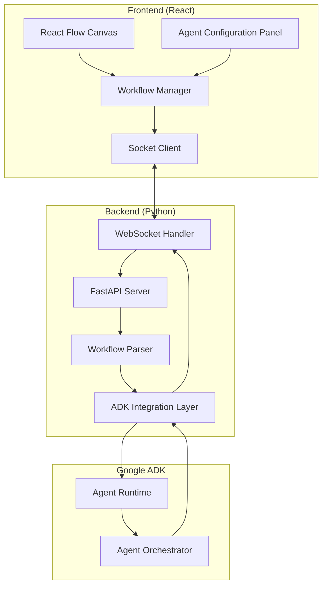

# Design Document

## Overview

The Visual Agent Flow Builder is a web-based application that enables users to create, configure, and execute agent workflows through a visual interface. The system uses React Flow for the frontend drag-and-drop interface and integrates with Google's Agent Development Kit (ADK) through a Python backend for workflow execution.

The architecture follows a clean separation of concerns with real-time communication via WebSockets, allowing users to design complex agent interactions visually and execute them on Google's ADK platform.

## Architecture

### High-Level Architecture



### Technology Stack

**Frontend:**
- React 18+ with TypeScript
- React Flow for visual workflow creation
- Socket.IO client for real-time communication
- Material-UI or Tailwind CSS for UI components
- Zustand or Redux Toolkit for state management

**Backend:**
- Python 3.10+
- FastAPI for REST API and WebSocket support
- Socket.IO for real-time communication
- Google ADK Python SDK
- Pydantic for data validation
- AsyncIO for concurrent execution

## Components and Interfaces

### Frontend Components

#### 1. FlowCanvas Component
```typescript
interface FlowCanvasProps {
  nodes: AgentNode[];
  edges: Connection[];
  onNodesChange: (changes: NodeChange[]) => void;
  onEdgesChange: (changes: EdgeChange[]) => void;
  onConnect: (connection: Connection) => void;
}
```

**Responsibilities:**
- Render the React Flow canvas
- Handle node and edge interactions
- Manage drag-and-drop operations
- Provide zoom and pan functionality

#### 2. AgentNode Component
```typescript
interface AgentNodeData {
  id: string;
  label: string;
  agent_type: 'agent' | 'workflow_agent';
  config: AgentConfiguration | WorkflowAgentConfiguration;
  status: 'idle' | 'running' | 'completed' | 'error' | 'streaming';
}

// Base Agent Configuration
interface AgentConfiguration {
  name: string;
  description?: string;
  prompt: string;
  tools: ToolConfiguration[];
  mcps: MCPConfiguration[];
  model?: ModelConfiguration;
  timeout?: number;
}

// WorkflowAgent extends Agent with sub-agents and execution type
interface WorkflowAgentConfiguration extends AgentConfiguration {
  sub_agents: AgentConfiguration[];
  execution_type: 'sequential' | 'loop' | 'parallel';
}

interface MCPConfiguration {
  name: string;
  server_url: string;
  authentication?: MCPAuthConfig;
  capabilities: string[]; // e.g., ['tools', 'resources', 'prompts']
  auto_connect: boolean;
}

interface MCPAuthConfig {
  type: 'bearer' | 'api_key' | 'oauth';
  credentials: Record<string, string>;
}

interface ToolConfiguration {
  name: string;
  description: string;
  type: 'function' | 'mcp_tool';
  // For function tools
  function_declaration?: FunctionDeclaration;
  // For MCP tools
  mcp_server?: string;
  mcp_tool_name?: string;
  parameters: Record<string, any>;
  enabled: boolean;
}

interface MCPServerConfiguration {
  name: string;
  server_url: string;
  authentication?: MCPAuthConfig;
  capabilities: string[]; // e.g., ['tools', 'resources', 'prompts']
  auto_connect: boolean;
}

interface MCPAuthConfig {
  type: 'bearer' | 'api_key' | 'oauth';
  credentials: Record<string, string>;
}

// Workflow-level configurations (not agent-level)
interface WorkflowRuntimeConfiguration {
  // Streaming Configuration (runtime property)
  streaming: StreamingConfiguration;
  
  // Memory Configuration (workflow-level)
  memory: MemoryConfiguration;
  
  // Session Configuration (workflow-level)
  session: SessionConfiguration;
  
  // Execution Configuration
  execution: ExecutionConfiguration;
}

interface ModelConfiguration {
  model_name: string; // e.g., "gemini-1.5-pro", "gemini-1.5-flash"
  temperature?: number;
  top_p?: number;
  top_k?: number;
  max_output_tokens?: number;
  safety_settings?: SafetySettings[];
}

interface ToolConfiguration {
  name: string;
  description: string;
  parameters: Record<string, any>;
  function_declarations?: FunctionDeclaration[];
}

interface StreamingConfiguration {
  enabled: boolean;
  chunk_size?: number;
  buffer_size?: number;
  stream_callback?: string; // Reference to callback function
}

interface MemoryConfiguration {
  type: 'short_term' | 'long_term' | 'episodic' | 'semantic';
  persistence: boolean;
  max_entries?: number;
  retention_policy?: RetentionPolicy;
  memory_store?: MemoryStoreConfig;
}

interface SessionConfiguration {
  session_id?: string;
  auto_generate_session: boolean;
  session_timeout?: number;
  session_persistence: boolean;
  context_window_size?: number;
}

interface ObservationConfiguration {
  name: string;
  type: 'user_input' | 'agent_output' | 'tool_call' | 'error' | 'custom';
  trigger_conditions: TriggerCondition[];
  callback_handler: string;
  data_extraction?: DataExtractionRule[];
}

interface CallbackConfiguration {
  name: string;
  event_type: 'on_start' | 'on_complete' | 'on_error' | 'on_stream' | 'on_tool_call';
  handler_function: string;
  parameters?: Record<string, any>;
  async_execution: boolean;
}

interface ExecutionConfiguration {
  timeout?: number;
  retry_policy?: RetryPolicy;
  error_handling: ErrorHandlingStrategy;
  parallel_execution?: boolean;
  resource_limits?: ResourceLimits;
}
```

**Responsibilities:**
- Display agent information and status
- Provide connection handles
- Show real-time execution status
- Handle node selection and configuration

#### 3. ConfigurationPanel Component
```typescript
interface ConfigurationPanelProps {
  selectedNode: AgentNode | null;
  onConfigUpdate: (nodeId: string, config: AgentConfiguration) => void;
  onClose: () => void;
}

interface PromptEditorProps {
  prompt: string;
  onPromptChange: (prompt: string) => void;
  templates: PromptTemplate[];
  showPreview: boolean;
  onTogglePreview: () => void;
}

interface PromptTemplate {
  id: string;
  name: string;
  description: string;
  category: string;
  prompt: string;
  tags: string[];
}
```

**Responsibilities:**
- Display agent configuration form with tabbed interface
- Provide dedicated markdown-enabled prompt editor with full-height editing area
- Support prompt templates via modal selection interface
- Enable split-view editing with markdown preview
- Support collapsible sections for managing long prompts
- Validate configuration inputs
- Update node configuration
- Show parameter documentation

#### 4. WorkflowManager Service
```typescript
interface WorkflowDefinition {
  id: string;
  name: string;
  description: string;
  nodes: AgentNode[];
  edges: Connection[];
  metadata: WorkflowMetadata;
}

class WorkflowManager {
  saveWorkflow(workflow: WorkflowDefinition): Promise<void>;
  loadWorkflow(id: string): Promise<WorkflowDefinition>;
  validateWorkflow(workflow: WorkflowDefinition): ValidationResult;
  exportToADK(workflow: WorkflowDefinition): ADKWorkflowDefinition;
}
```

### Backend Components

#### 1. WebSocket Handler
```python
class WorkflowSocketHandler:
    async def handle_workflow_submission(self, workflow_data: dict) -> None
    async def handle_execution_request(self, workflow_id: str) -> None
    async def broadcast_execution_status(self, status: ExecutionStatus) -> None
    async def send_error(self, error: WorkflowError) -> None
```

**Responsibilities:**
- Handle real-time communication with frontend
- Process workflow submission requests
- Stream execution updates
- Manage client connections

#### 2. ADK Integration Layer
```python
class ADKIntegrator:
    def __init__(self, adk_config: ADKConfig):
        self.client = ADKClient(adk_config)
        self.session_manager = SessionManager()
        self.memory_manager = MemoryManager()
        self.mcp_manager = MCPManager()
    
    async def create_agents(self, workflow: WorkflowDefinition) -> List[ADKAgent]:
        """Create ADK agents with model configuration, tools, MCP integration, and agent-specific callbacks"""
        
    async def setup_mcp_servers(self, mcp_configs: List[MCPServerConfiguration]) -> Dict[str, MCPServer]:
        """Initialize and connect to MCP servers for external tool and resource access"""
        
    async def register_mcp_tools(self, agent: ADKAgent, mcp_tools: List[MCPToolConfiguration]) -> None:
        """Register MCP tools with agents for external function calling"""
        
    async def handle_mcp_tool_calls(self, tool_call: MCPToolCall) -> MCPToolResult:
        """Execute MCP tool calls through connected servers"""
        
    async def register_agent_callbacks(self, agent: ADKAgent, callbacks: List[CallbackConfiguration]) -> None:
        """Register agent-specific event callbacks for lifecycle and execution events"""
        
    async def setup_agent_observations(self, agent: ADKAgent, observations: List[ObservationConfiguration]) -> None:
        """Configure agent-specific observation handlers for monitoring behavior"""
        
    async def create_workflow_session(self, session_config: SessionConfiguration) -> ADKSession:
        """Create and manage workflow-level session with context persistence"""
        
    async def setup_workflow_memory(self, memory_config: MemoryConfiguration) -> MemoryStore:
        """Initialize workflow-level memory store with persistence and retention policies"""
        
    async def configure_workflow_streaming(self, runtime_config: WorkflowRuntimeConfiguration) -> StreamingHandler:
        """Configure workflow-level streaming capabilities for real-time response processing"""
        
    async def configure_conversation_flow(self, agents: List[ADKAgent], connections: List[Connection]) -> ConversationFlow:
        """Set up conversation flow between agents based on visual connections"""
        
    async def execute_workflow(self, 
                              conversation_flow: ConversationFlow, 
                              session: ADKSession,
                              memory_store: MemoryStore,
                              streaming_handler: StreamingHandler,
                              mcp_servers: Dict[str, MCPServer]) -> AsyncIterator[ExecutionEvent]:
        """Execute workflow through conversation flow with session, memory, streaming, and MCP support"""
        
    async def handle_tool_calls(self, agent: ADKAgent, tool_calls: List[ToolCall]) -> List[ToolResult]:
        """Process tool calls including both native ADK tools and MCP tools"""
        
    def validate_adk_compatibility(self, workflow: WorkflowDefinition) -> ValidationResult:
        """Validate workflow against ADK constraints and capabilities including MCP integration"""
```

**Responsibilities:**
- Translate workflow definitions to ADK format
- Create and configure ADK agents
- Set up agent orchestration
- Execute workflows and stream results

#### 3. Workflow Parser
```python
class WorkflowParser:
    def parse_frontend_workflow(self, workflow_data: dict) -> WorkflowDefinition
    def validate_workflow_structure(self, workflow: WorkflowDefinition) -> ValidationResult
    def convert_to_adk_format(self, workflow: WorkflowDefinition) -> ADKWorkflowSpec
    def extract_agent_dependencies(self, workflow: WorkflowDefinition) -> DependencyGraph
```

## Data Models

### Workflow Definition Schema
```json
{
  "id": "string",
  "name": "string",
  "description": "string",
  "version": "string",
  "nodes": [
    {
      "id": "string",
      "type": "agent",
      "position": {"x": 0, "y": 0},
      "data": {
        "agentType": "string",
        "configuration": {},
        "inputPorts": [],
        "outputPorts": []
      }
    }
  ],
  "edges": [
    {
      "id": "string",
      "source": "string",
      "target": "string",
      "sourceHandle": "string",
      "targetHandle": "string",
      "data": {
        "dataType": "string",
        "transformation": {}
      }
    }
  ],
  "metadata": {
    "createdAt": "ISO8601",
    "updatedAt": "ISO8601",
    "author": "string"
  }
}
```

### ADK Agent Configuration
```python
@dataclass
class ADKAgentSpec:
    # Basic Agent Configuration
    agent_id: str
    agent_type: str
    name: str
    description: str
    
    # Model Configuration
    model_config: ModelConfig
    system_instructions: str
    
    # Tools and Functions
    tools: List[ToolSpec]
    function_declarations: List[FunctionDeclaration]
    
    # MCP (Model Context Protocol) Configuration
    mcp_servers: List[MCPServerSpec] = None
    mcp_tools: List[MCPToolSpec] = None
    
    # Agent-specific Callbacks and Observations
    callbacks: List[CallbackSpec]
    observations: List[ObservationSpec]
    
    # Input/Output Schemas
    input_schema: Dict[str, Any]
    output_schema: Dict[str, Any]
    
    # Dependencies and Orchestration
    dependencies: List[str]
    execution_order: int

@dataclass
class MCPServerSpec:
    name: str
    server_url: str
    authentication: Optional[MCPAuthSpec] = None
    capabilities: List[str] = None  # ['tools', 'resources', 'prompts']
    auto_connect: bool = True
    timeout: int = 30

@dataclass
class MCPToolSpec:
    server_name: str
    tool_name: str
    description: str
    parameters: Dict[str, Any]
    enabled: bool = True
    
@dataclass
class MCPAuthSpec:
    auth_type: str  # 'bearer', 'api_key', 'oauth'
    credentials: Dict[str, str]

@dataclass
class ModelConfig:
    model_name: str  # "gemini-1.5-pro", "gemini-1.5-flash", etc.
    temperature: float = 0.7
    top_p: float = 0.95
    top_k: int = 40
    max_output_tokens: int = 8192
    safety_settings: List[SafetySetting] = None
    
@dataclass
class StreamingConfig:
    enabled: bool = False
    chunk_size: int = 1024
    buffer_size: int = 4096
    stream_callback: Optional[str] = None
    real_time_processing: bool = True

@dataclass
class MemoryConfig:
    memory_type: str  # "short_term", "long_term", "episodic", "semantic"
    persistence_enabled: bool = False
    max_entries: int = 1000
    retention_policy: RetentionPolicy = None
    memory_store_type: str = "in_memory"  # "in_memory", "redis", "firestore"
    
@dataclass
class SessionConfig:
    session_id: Optional[str] = None
    auto_generate_session: bool = True
    session_timeout: int = 3600  # seconds
    context_window_size: int = 32768
    session_persistence: bool = True
    
@dataclass
class CallbackSpec:
    name: str
    event_type: str  # "on_start", "on_complete", "on_error", "on_stream", "on_tool_call"
    handler_function: str
    parameters: Dict[str, Any] = None
    async_execution: bool = True
    
@dataclass
class ObservationSpec:
    name: str
    observation_type: str  # "user_input", "agent_output", "tool_call", "error"
    trigger_conditions: List[TriggerCondition]
    callback_handler: str
    data_extraction_rules: List[DataExtractionRule] = None

@dataclass
class ADKWorkflowSpec:
    workflow_id: str
    name: str
    description: str
    version: str
    
    # Agent Specifications
    agents: List[ADKAgentSpec]
    
    # Orchestration Configuration
    orchestration: OrchestrationSpec
    
    # Execution Configuration
    execution_config: ExecutionConfig
    
    # Global Session Management
    global_session_config: SessionConfig
    
    # Workflow-level Memory
    shared_memory_config: MemoryConfig
    
    # Error Handling
    error_handling_strategy: ErrorHandlingStrategy

@dataclass
class OrchestrationSpec:
    execution_mode: str  # "sequential", "parallel", "conditional"
    dependency_graph: Dict[str, List[str]]
    data_flow_mapping: Dict[str, DataFlowRule]
    conditional_logic: List[ConditionalRule] = None
    
@dataclass
class ExecutionConfig:
    timeout: int = 300  # seconds
    retry_policy: RetryPolicy = None
    resource_limits: ResourceLimits = None
    parallel_execution: bool = False
    max_concurrent_agents: int = 5
```

## Error Handling

### Frontend Error Handling
- **Validation Errors:** Display inline validation messages for invalid configurations
- **Connection Errors:** Show connection status and retry mechanisms
- **Execution Errors:** Highlight problematic nodes and display error details
- **Network Errors:** Implement exponential backoff for WebSocket reconnection

### Backend Error Handling
- **ADK Integration Errors:** Catch and translate ADK-specific errors to user-friendly messages
- **Workflow Validation Errors:** Provide detailed validation feedback with suggestions
- **Execution Errors:** Capture agent execution failures and provide debugging information
- **Resource Errors:** Handle memory and processing limitations gracefully

### Error Response Format
```json
{
  "error": {
    "code": "WORKFLOW_VALIDATION_ERROR",
    "message": "Human-readable error message",
    "details": {
      "nodeId": "string",
      "field": "string",
      "expectedType": "string",
      "actualValue": "any"
    },
    "suggestions": ["string"]
  }
}
```

## Testing Strategy

### Frontend Testing
- **Unit Tests:** Jest and React Testing Library for component testing
- **Integration Tests:** Test React Flow interactions and state management
- **E2E Tests:** Playwright for full workflow creation and execution scenarios
- **Visual Regression Tests:** Chromatic for UI consistency

### Backend Testing
- **Unit Tests:** pytest for individual component testing
- **Integration Tests:** Test ADK integration with mock ADK services
- **API Tests:** FastAPI test client for endpoint testing
- **WebSocket Tests:** Test real-time communication scenarios

### Test Data Management
- Mock ADK responses for consistent testing
- Predefined workflow templates for testing various scenarios
- Automated test workflow generation for edge cases
- Performance testing with large workflow definitions

### Continuous Integration
- Automated testing on pull requests
- Frontend and backend testing in parallel
- Integration testing with ADK sandbox environment
- Performance benchmarking for workflow execution times